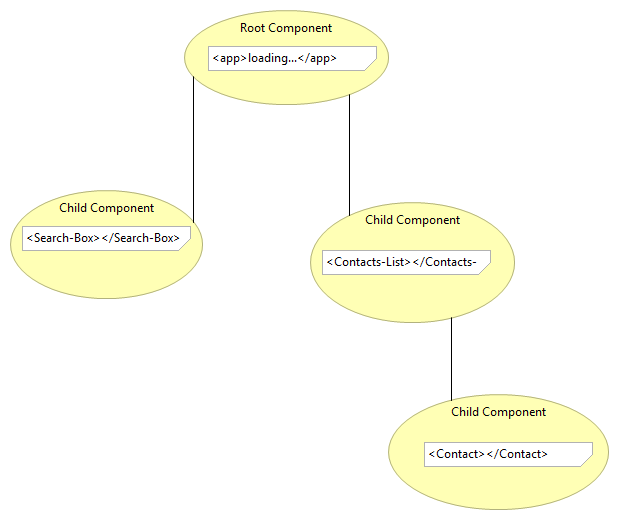

#**Angular Components**

An angular2 application is a tree of components - a composition tree.
Directives and Components are the fundamental building blocks of an Angular2 application.

1. The Top level component is the application it self. The `root component`.

2. Components are structured in a parent child tree.
Parents render children when they render.

3. Any component can be bootstrapped as an application.

4. Any component can be loaded into a router view outlet.

5. To do anything complex components will contain and use other components.

6. Directives are components without a template i.e a view. They just add behaviour.

7. Components have defined inputs and outputs - data and behaviour - their public API.

8. Components have well-defined lifecycle i.e their private API

9. They are self-describing in terms of state/data, behaviour and layout.

## Summary
To build an Angular 2 application we define a set of components, for every UI element, view, and route.
An application will always have a root component that contains all other components.
So an Angular 2 application is a component tree,like the following.

A component has input and output properties.
Those will be defined in the component decorator `@Component()` or using property decorators (`@Input()` and `@Output()`).

` Code example`

## Input - Output
Input and output properties will form the public API of a component.
We use them to initialise the state (data) of a component and define the behaviour i.e. the events that the component will raise.

To turn an Angular component into something rendered in the DOM we have to associate an Angular component with a DOM element.
The element that hosts the component is called the `Host` element.

We can set input properties using property bindings, through square brackets. We can subscribe to output properties using event bindngs, through parenthesis.

//TODO
 ## Template
A component will have a `template`, which describes how the component is rendered on the page
and how the component can interact with its host DOM element in the following ways:
 * It can listen to its events.
 * It can update its properties.
 * It can invoke methods on it.

